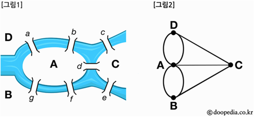
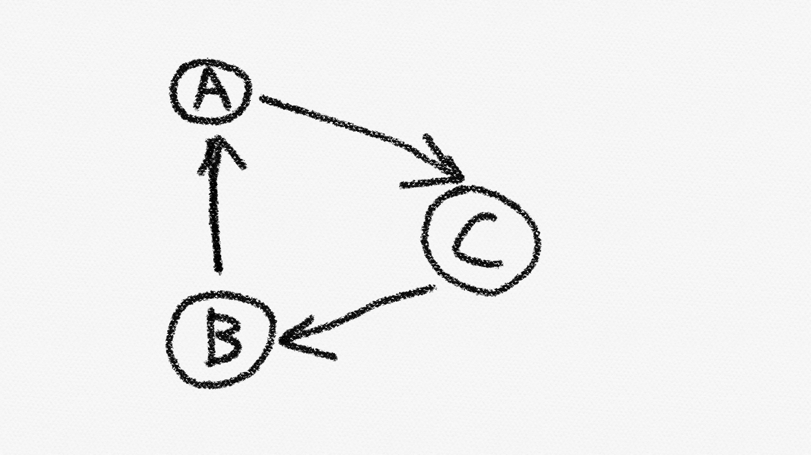
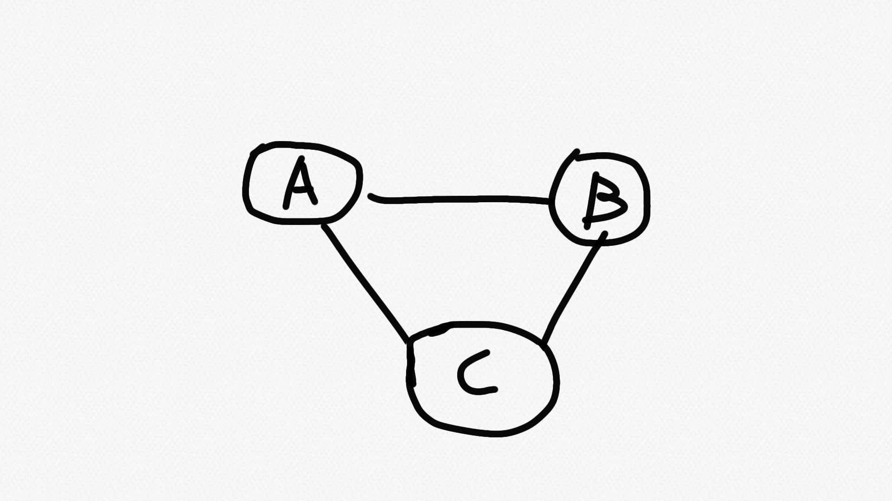
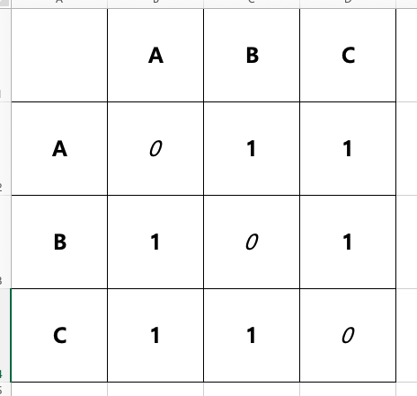
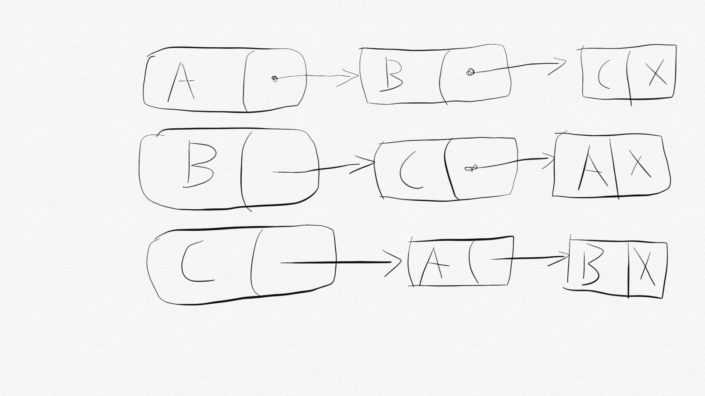

# Graph

## 그래프 개요
<br>
그래프는 선으로 된 간선(Edge)과 간선과 간선이 만나는 정점(Vertex)를 특징으로 하는 자료구조이다.<br>
그래프의 종류에는 방향성 그래프, 무방향 그래프, 가중치 그래프, 부분 그래프 등이 있다.
그래프는 정점과 간선의 집합이다. 따라서 집합의 표기법을 사용해 그래프를 표현할 수도 있다. [그림2]를 통해 그래프화한 쾨니히스베르크의 다리를 예로 들어보자.<br>
[그림2]의 그래프를 Q라고 명명할때 그래프 Q의 정점 집합은 V(Q)로 표시하고 간선 집합은 E(Q)로 표시한다.<br>
또 무방향 그래프에서 정점 A와 정점 B를 연결하는 간선은 (A, B)로 표시한다. 
따라서 [그림2]의 그래프를 집합으로 표현하면 다음과 같이 표기할 수 있다.
([그림2]에서 정점 A와 D, 정점 A와 B를 잇는 간선은 하나로 단순화한다.)<br><br>
V(Q) = {A, B, C, D}<br>
E(Q) = {(A,B)(A,C)(A,D)(B,C)(C,D)}<br><br>

<br>
위 그래프를 G라고 했을때, G와 같이 방향성이 있는 그래프는 홑화살 괄호('<', '>')를 써 다음과 같이 표기한다.<br><br>
V(G) = {A,B,C}<br>
E(G) = {<A,C><C,B><B,A>}<br><br>
## 그래프의 ADT
그래프 자료형은 범용적인 자료형으로 구성하려고 하기 보다 주어진 문제 해결을 위해 필요한 만큼만 구현하는 방식이 유용하다.<br>
교재에서는 아래와 같이 ADT를 정의한다.<br>
```C
void GraphInit(UALGraph * pg, int nv);
//그래프의 초기화를 진행한다.
//두 번째 인자로 정점의 수를 전달한다.
void GraphDestroy(UALGraph * pg);
//그래프 초기화 과정에서 할당한 리소스를 반영한다.
void AddEdge(UALGraph * pg, int fromV, int toV);
//매개변수 fromV로 전달된 정점을 연결하는 간선을 그래프에 추가한다.
//void ShowGraphEdgeInfo(UALGraph * pg);
//그래프의 간선 정보를 출력한다.
```
그래프의 초기화 함수의 매개변수가 정수형으로 전달되면 초기화시 정점의 개수가 결정된다.<br>
이때 정점의 이름은 정점의 개수에 따라 동적으로 정해지도록 헤더 파일 안에 enum{A,B,C,D,E}와 같이 열거형 상수로 정의해둔다.<br>
만약 void GraphInit(UALGraph * pg, int nv)의 nv로 3이 주어지면 정점의 이름은 차례로 A,B,C가 된다.<br>

## 그래프의 구현
그래프의 구현에는 인접 행렬이나 인접 리스트를 사용할 수 있다.
다음과 같은 그래프 모형이 있다고 하자.<br>
<br>
위와 같은 무방향성 그래프를 이차원 행렬로 표시하면 다음과 같다.<br>
<br>
위 행렬은 각 정점 사이 간선의 수를 나타낸다.
각 정점에는 자신을 가리키는 간선이 없으므로 대각선 방향의 값은 0
이 되고 서로를 가리키는 간선은 1이 된다. 이차원 배열을 사용해 그대로 구현하면 된다.
방향 그래프는 위와 같은 모형에서 방향이 가리키는 곳에만 간선값을 넣어주면 된다. <br>
만약 인접 리스트를 사용해 위 그래프 모형을 구현한다면 다음과 같다.
<br>
인접 리스트를 통해 방향성 그래프를 구현할 때는 노드가 가리키는 방향이 없는 경우 NULL을 가리키게 만들면 된다.

## C graph.h 연결 리스트 기반 

```C
//연결 리스트를 사용한 그래프의 헤더파일
#ifndef __AL_GRAPH__
#define __AL_GRAPH__

#include "LinkedList" //교재에서는 이전에 구현한 연결리스트를 사용한다.

enum {A,B,C,D,E,F,G,H,I,J,K};

typedef struct _graph
{
	int vertex;
	int edge;
	List * adjList;
} graph;

void GraphInit(graph * pg, int num_vertex);
void GraphDestroy(graph * pg);
void AddEdge(graph * pg, int from_vertex, int to_vertex);
void ShowGraphEdgeInfo(graph * pg);

#endif
```

## C graph.c 연결 리스트 기반
```C
#include<stdio.h>
#include<stdlib.h>
#include"graph.h"
#include"LinkedList.h"

int whoIsPrecede(int data1, int data2);

void GraphInit(graph * pg, int num_vertex);
{
	int i;

	pg -> adjList = (List*)malloc(sizeof(List) * num_vertex);
	pg -> vertex = num_vertex;
	pg -> Edge = 0; //처음에 간선은 0으로 초기화한다.

	for(i = 0; i < num_vertex; i++)
	{
		ListInit(&(pg -> adjList[i]));
		SetSortRule(%(pg -> adjList[i]), whoIsPrecede);
	}
}

void GraphDestroy(graph * pg)
{
	if(pg -> adjList != NULL)
		free(pg -> adjList);
}

void AddEdge(graph * pg, int From from_vertex, int to_vertex)
{
	Linsert(&(pg -> adjList[from_vertex], to_vertex);
	Linsert(&(pg -> adjList[to_vertex], from_vertex);
	pg -> numE += 1;
}

void ShowGraphEdgeInfo(graph * pg)
{
	int i;
	int vx;

	for(i = 0; i < pg -> num_vertex; i++)
	{
		printf("%c와 연결된 정점: ", i + 65);

		if(LFirst(&(pg -> adjList[i]), &vx))
		{
			printf("%c ", vx + 65);

			while(LNext(&(pg -> adjList[i]), &vx))
				printf("%c ", vx + 65);
		}
		printf("\n");
	}
}

int whoIsPrecede(int data1, int data2)
{
	if(data1 < data2)
		return 0;
	else
		return 1;
}
```

## 그래프의 탐색
### 깊이우선탐색(DFS)🔬
깊이우선탐색은 한 길을 깊이 파고드는 탐색 방식이다.
간선으로 연결된 정점 ABCD가 있을 때, 메시지의 전송흐름이
A -> B -> C -> D 를 거친다고 하자. 메시지가 D에 도달하면 D는 더이상 메시지를 전달할 대상이 없게된다.
이렇게 연락할 대상이 없게 되면 자신에게 연락을 취한 대상에 메시지를 되돌리면 된다.
이런 방식으로 D -> C -> B -> A 를 거쳐 처음 메시지를 송신한 A에게 메세지가 돌아오게 되면 깊이우선탐색이 끝난다.

### 너비우선탐색(BFS)🔭
너비우선탐색은 한 정점을 기준으로 뻗쳐있는 모든 간선을 따라 탐색을 진행하는 방식이다. 
만약 한 정점 A에 간선이 여러 개 있다면 간선을 타고 여러 개의 메시지가 동시다발적으로 전송된다. 
메시지를 전송받은 다음 정점도 이전과 마찬가지로 메시지를 전송하게 되는데
이때 일반적인 상황에서 우선순위는 크게 중요하지 않다. 
임의로 우선순위를 둘 수도 있지만 일반적으로는 신경쓰지 않는다.
너비우선탐색은 마지막으로 메시지를 수신한 정점이 메시지를 송신할 기회를 가질 때 끝난다.

-- 03/27


