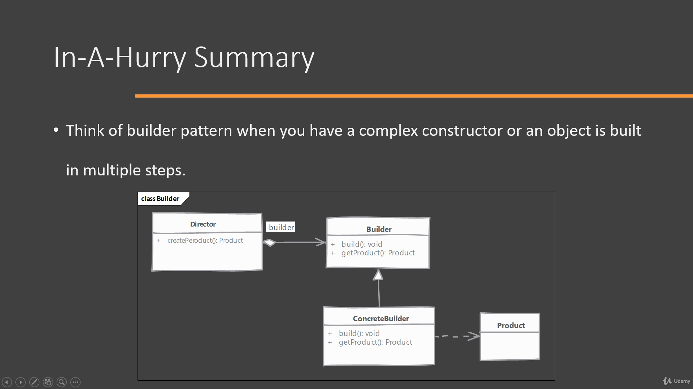
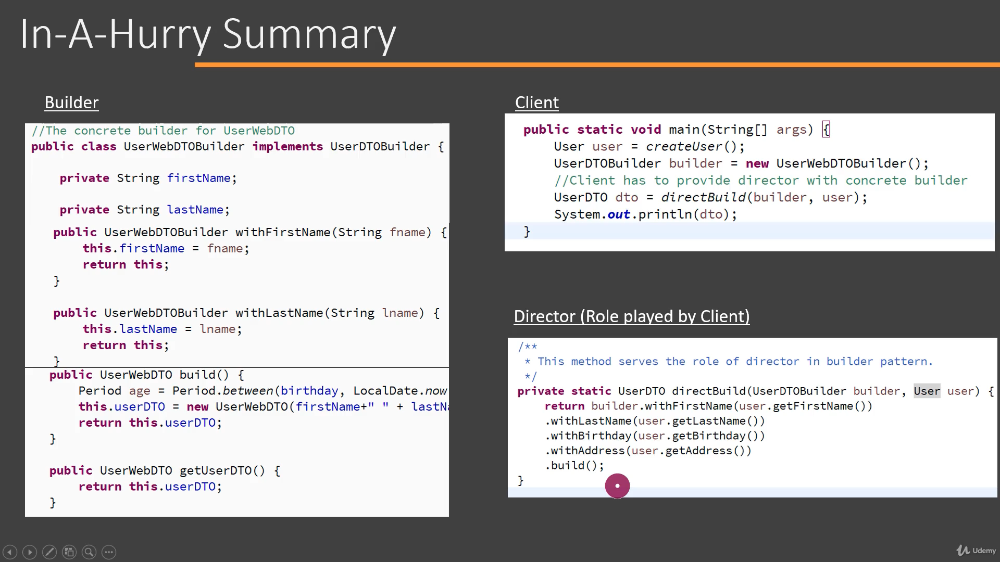

# 🏗️Builder Pattern
**생성패턴** 

객체가 복잡하거나 많은 프로퍼티(변수, 데이터...)를 갖췄을 때, 
객체를 보다 유연하게 하기 위해 기본 생성자 외에
별도로 중첩 클래스나 메서드를 둬 객체의 프로퍼티를 설정하도록 만드는 디자인 패턴이다. 클라이언트가 인터페이스를
직접 구현하거나 생성자를 선택해 객체의 속성을 정할 수 있다. 

 
*빌더패턴에 대한 유스케이스 다이어그램* 

디렉터가 프로덕트라는 객체를 생성하려고 할 때 프로덕트에 들어갈 변수와 데이터가 너무 많으면 빌더 패턴을 고려해본다.
이때 디렉터는 객체를 생성하기 위한 절차를 알고 있어야 한다.
빌더라는 추상 클래스 또는 인터페이스가 있으면 디렉터는 이를 구체화한 클래스를 만든다.
디렉터는 추상 빌더 클래스나 인터페이스를 구현한 클래스에서 
프로퍼티에 값을 넣는 메소드를 구현해 객체를 생성할 수 있다.
빌더 패턴은 일반적으로 프로퍼티를 지정하는 여러개의 메소드
와 이를 통합하는 빌드 메소드를 갖는다. 빌드 메소드는
일반적으로 메서드 체이닝을 통해 여러 속성을 통합하지만 메서드체이닝이 의무사항은 아니다.

 

 
 

인터페이스 구현과 메서드 체이닝

🔔
빌더 패턴으로 코딩 이후 프로퍼티가 메서드
추가만으로는 관리하기 힘들 정도로 많아질 경우 텔레스코프 빌더 패턴도 고려할 수 있다.
텔레스코프 빌더 패턴은 매개변수를 달리 하는 생성자를 여러
개 둬서 선택지를 넓힌 패턴이라고 일단은 생각하자.

- java.util.Calendar.Builder 클래스로 더 공부하기

---
0324

빌더 패턴의 문맥은 이해하지만 디자인 패턴 자체에 대한 이해와 직접적인 구현에 필요한 전반적인 개념이 생소.
자바 복습도 필요. 빌더 패턴 관련 예시 찾아서 클론 코딩해보고 강의 다시 듣기. 

우선순위
1. 자바 복습(생성자, 추상클래스, 인터페이스, 객체지향 )
2. 빌더패턴 예시 찾아서 클론 코딩
3. java.util.Calendar.Builder 클래스 공부
4. 강의 다시듣기 

