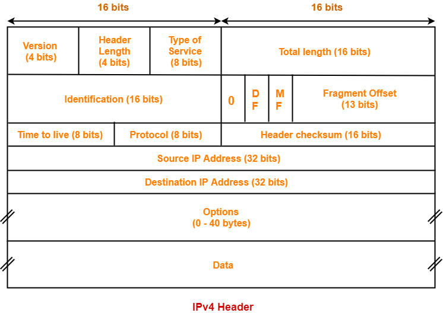

# Network - 0630

## TCP/IP 송, 수신구조
#### 송신
L5 -> 프로세스의 스트림을 자르는 한 단위는 버퍼로 애플리케이션 개발자에 의해 범위가 정해진다.  
L4 -> 버퍼가 소켓을 통해 TCP 계층으로 전달되면 세그먼트 단위로 분해된다.  
L3 -> 세그먼트는 다시 IP 계층으로 내려가 패킷에 캡슐화된다.  
L2 -> 세그먼트는 드라이버 계층에서 다시 캡슐화되어 프레임이 된다.  
프레임은 패킷 박스를 가득 실은 트럭과 같아서 데이터 전달과정에서 여러 번 바뀔 수 있다.  

#### 수신
L2 -> 프레임에서 나온 패킷 상자를 꺼내면 프레임은 사라진다.  
L3 -> 패킷에서 세그먼트를 꺼내고 패킷은 사라진다.  
L4 -> 운영체제의 TCP 스택이 소켓 I/O 메모리 버퍼에 세그먼트를 채운다.  
소켓 I/O 버퍼의 #1, #2에 차례로 세그먼트가 채워지면 소켓 I/O 버퍼는 
Acknowledge 메시지(Ack#3 + 여유공간)를 대기 중인 프레임에 보내 #3 프레임을 받아온다.  
여유공간이 있는 동안 해당 작업을 반복한다.   
Loss(Lost Segment) 장애, Re-Transmission(Ack-Duplication) 장애, Out of Order(순서) 장애,  
Zero Window(여유 공간) 장애 등은 TCP 메시지 송수신 문제일 확률이 높다.  
L5 -> 프로세스가 RECIEVE(READ)를 통해 소켓 I/O 메모리 버퍼를 프로세스 버퍼로 읽어온다.   
  
## IPv4 헤더 형식
IP 헤더는 20byte, MTU는 1500 - 20 byte 정도이다.  
 
와이어 샤크를 통해 분석할 수 있다. 단편화나 추가적인 개념들은 차차 알아가자.  
  
## 서브넷 마스크
송신부 IP주소의 네트워크ID를 비트 단위로 AND연산(네트워크의 원래 주소가 나옴)해 네트워트 주소를 구한다.  
이를 마스크 연산이라고도 한다.
이 주소가 수신부 호스트의 네트워크ID와 일치하면 수신부 호스트에게 전달된 데이터로 보고 송/수신한다.  
과거에는 여기에 클래스 개념이 붙었지만 현재는 개선돼 CIDR 방식이 적용된다.  
서브네팅(호스트ID의 2비트를 추가로 네트워크ID에 더해 네트워크ID를 부여하는 것, 호스트ID는 6비트가 된다.)도 있다는 정도로 알아두자.  
  
## Broadcast IP주소 
호스트ID가 1111인 IP주소이다. 전방위적으로 패킷을 전송한다. 네트워크 장비에 부담이 많이 가고  
비효율적인 송신 방식. 특별한 이유가 없는 이상 쓰지 않는 게 좋다.  
추가적으로 브로드 캐스트의 아이디가 1111이고 여러 네트워크 장비에 할당되는 호스트ID가 0번에서 5번까지  
를 차지하므로 실질적으로 클라이언트가 사용할 수 있는 호스트ID는 대략 250개 정도이다.  
  
## 127.0.0.1
127.0.0.1은 Host 자신을 가리키는 IP주소이다.  
Loopback Address라고 한다. 동일 컴퓨터에서 다른 프로세스끼리 네트워킹할 때 사용한다.  
위 상황에서 실제 패킷이 물리/데이터 계층까지 내려가는 건 아니다. 127.0.0.1을 수신부로 하면 IP 프로토콜이 실제 IP주소에 관계없이 동일 컴퓨터 내의 전달하고자 하는 프로세스에 패킷을 전달한다.  

## 인터넷은 라우터의 집합체, 논리 네트워크이다.
인터넷 = 라우터 + DNS 집합  
TTL은 Time To Live의 약자. 홉 단위로 수명이 줄어든다.  
단편화는 MTU(1500) 크기 차이로 발생한다.  
  
## 인터넷 사용 전 설정
IP주소, Subnet Mask, Gateway IP주소, DNS 주소 등을 세팅한다.  
DHCP(Dynamic Host Configuration Protocol)체계는 주소를 할당하는 서버와 할당받는 클라이언트로 구성된다.  
DHCP는 인터넷 설정을 자동화해 내가 사용할 IP 주소를 서버가 알려준다.  
  
## ARP
일반적으로 IP 주소와 MAC주소는 쌍을 이룬다. Address Resolution Protocol은 IP주소로 MAC주소를 알아낼 때 사용한다.  
  
## Ping과 RTT
Ping 유틸리티는 특정 호스트에 대한 RTT(Round Trip Time)을 측정하는데 사용된다.  
RTT란 패킷이 목적지에 도달하고 그에 대한 응답이 출발지로 돌아오기까지의 시간을 말한다.  
ICMP 프로토콜을 이용하며 DoS(Denial of Service) 공격용으로 악용되기도 한다.  

## TCP와 UDP
연결 지향이냐 아니냐로 TCP(Connection, Session)/UDP가 나뉜다.   
연결은 순서번호로 구현되고 상태(전이) 개념을 동반한다.  
클라이언트의 프로세스가 소켓을 오픈하면 프로세스는 PID를 받는다.  
운영체제는 프로세스 소켓에 TCP PORT 번호를 열어준다.  
  
## 3 way, 4 way handshaking
추가 학습 필요  
  
## DNS(Domain Name System)
웹사이트 링크가 전송되면 DNS라는 DB에서 해당 링크의 값에 해당하는 IP주소를 알려준다.  

