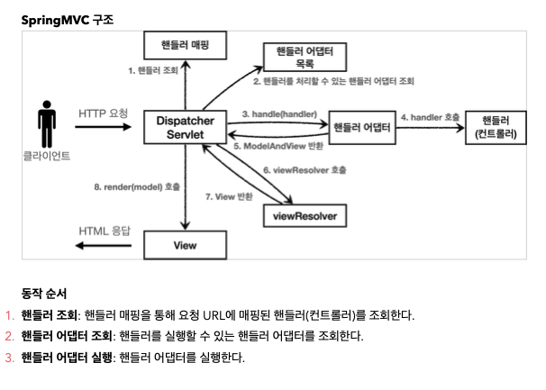
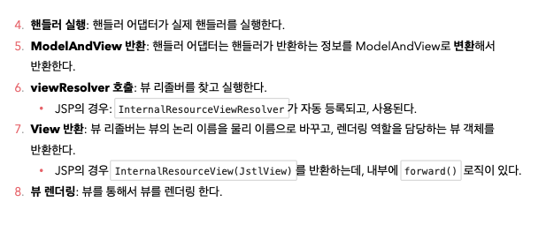

# spring0704

## Spring MVC 구조
 
 

프론트 컨트롤러 패턴 적용(Dispatcher Servlet), 해당 이미지가 자동으로 연상될 때까지 외운다.  
스프링MVC의 세세한 내부 구현은 너무 방대해서 다 알기 어렵지만 트러블 슈팅을 위해 나중에 장애가 발생하면  
어떤 기능이 잘못돼 장애가 발생했는지 알 수 있어야 한다.  
  
## Spring의 핸들러 매핑과 핸들러 어댑터
과거에는 핸들러 매핑을 위해 Controller라는 인터페이스(@Controller와 다름)을 제공했다. Controller는 HttpServletRequest와 HttpServletResponse를 매개변수로 받아 ModelAndView를 반환하는 추상 메서드이다. 
Controller 인터페이스를 통해 핸들러 매핑과 어댑터 기능을 사용하려면 Controller 구현 클래스에 @Component(/springmvc/oldcontroller)와 같은 애노테이션을 붙여 해당 url을 이름으로 하는 빈을 스프링 컨테이너에 등록했다. 
이후 스프링 부트의 자동 핸들러 매핑 기능 중 하나인 BeanNameUrlHandlerMapping이 동작해 빈 네임으로 url에 해당하는 핸들러를 찾고 핸들러 어댑터에서 SimpleControllerHandlerAdapter를 이용해 Controller구현 클래스를 내부에서 실행하고 결과값을 반환한다. 
  
정리하자면 과거 Controller 인터페이스를 사용한 핸들러 사용법은  
1. 핸들러 매핑 정보(빈에 등록된 핸들러 이름)를 통해 핸들러를 찾는다.  
2. 핸들러 어댑터에서 해당 핸들러를 조회해 호환 가능성 여부를 확인한다.  
3. 해당 핸들러가 호환 가능하다면 이를 내부에서 실행해 결과값을 반환한다.  
이다. 현재는 RequestMappingHandlerMapping과 RequestMappingHandlerAdapter를 사용해 @RequestMapping 애노테이션을 사용한 방식이 실무에서 쓰인다. Controller 인터페이스 사용은 간단하게 알고 넘어가자. 
  
## 뷰 리졸버 동작 방식
스프링에서 핸들러를 호출해 뷰를 반환하게 하면 핸들러는 뷰의 논리 이름을 반환한다. 이를 실제 물리 이름으로 변환해 실행 가능하게 하는 건 뷰 리졸버의 역할이다. 
스프링 부트는 빈 이름을 찾아 뷰를 반환하게 하는 BeanNameViewResolver와 JSP를 처리하는 뷰를 반환하는 InternalResourceViewResolver를 자동 설정으로 등록한다. 
그 외에도 많은 뷰 리졸버 동작 설정과 동작 방식이 있지만 이 정도로 알아두자. 
  
## 실무에서 사용하는 스프링 MVC
위 방식들은 구버전에서 사용하던 방식들이다. 현재는 애노테이션을 활용한 방식을 사용한다. 하지만 구버전의 맥락을 이해하지 못하면 현재의 기술이 왜 이런 방식으로 사용되게 되었는지 이해하기 어렵기에 구버전의 작동 방식도 간단하게나마 알아두자. 

1. @Controller, @RequestMapping, ModelAndView
클래스 레벨에 @Controller를 붙이면 @Controller가 @Component를 내장하기 때문에 해당 클래스는 자동으로 스프링 빈에 등록된다. 
해당 클래스에서 @RequestMapping(/spring/url)과 같이 url을 매핑하면 해당 url이 호출될 때 @RequestMapping이 붙은 메서드를 자동으로 호출해준다. 
RequestMappingHandlerMapping, RequestMappingHandlerAdapter가 동작해 이를 처리해주는 것이다. @RequestMapping이 호출하는 메서드에서 ModelAndView에 뷰의 논리 이름을 담아 반환하면 url 호출에 따른 메서드 동작이 가능하다. 
  
2. @RequestParam
@RequestParam("name")은 메서드 안 매개변수 앞에 사용하며 괄호 안 문자열에 해당하는 값을 매개변수의 인자로 전달한다. 
required 옵션을 사용해 매개변수 값의 유무를 강제할 수 있으며(디폴트 값은 true로 반드시 값이 있어야 한다.) 값이 없을시
defaultValue옵션을 설정해 디폴트 값을 줄 수도 있다. 
  
3. @GetMapping, @PostMapping, @PutMapping, @DeleteMapping, @PatchMapping
위 어노테이션들은 @RequestMapping(method = "RequestMethod.특정HTTP메서드")를 설정한 것과 같다. 
URL을 매칭하면서 동시에 HTTP의 메서드를 구분해 매핑하는 기능이다. 
  
4. @RestController
@Controller와 @ResponseBody가 합쳐진 애노테이션이라고 생각하면 된다. @Controller의 메서드는 반환값으로 뷰를 찾아 반환하는데 반해 
@RestController의 메서드는 반환값을 HTTP Body에 직접 써서 반환한다. @Controller가 붙은 클래스의 모든 메서드에 @ResponseBody가 붙어있는 형태라고 한다. 
  
5. @Slf4j
다양한 로그 라이브러리를 인터페이스 형태로 제공하는 게 Slf4j이다. 일반적으로 스프링에서 기본 제공하는 Logback을 사용한다. 
@Slf4j애노테이션으로 바로 가져다 쓸 수 있다. 

